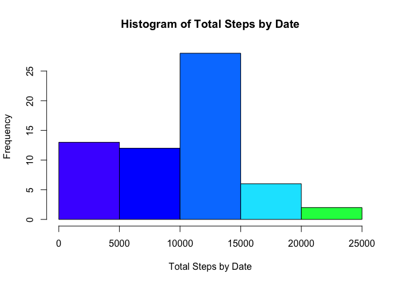
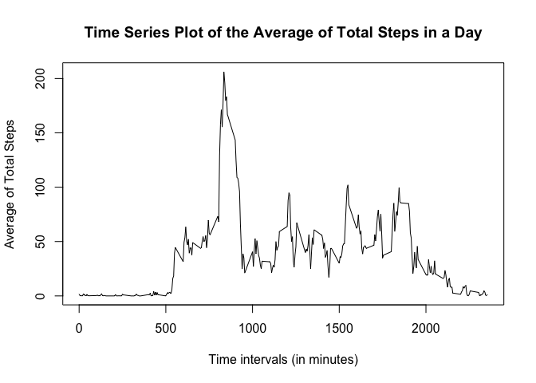
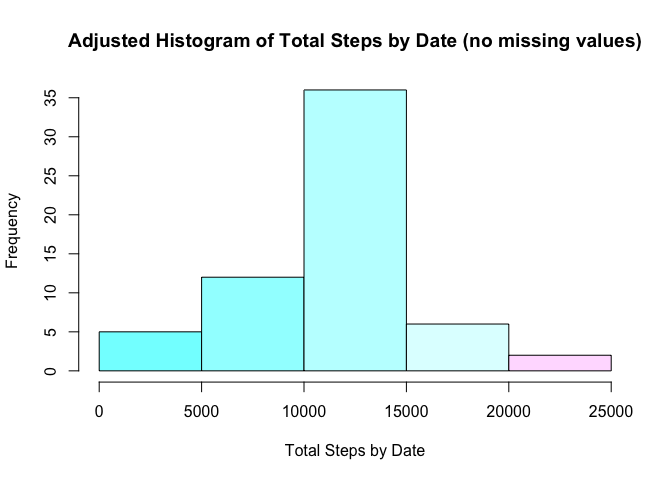
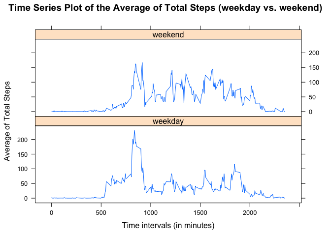

# Reproducible Research Project 1
Ben Karmay  
04/11/2017  

###Loading and preprocessing the data


```r
act <- read.csv("activity.csv")
str(act) 
```

```
## 'data.frame':	17568 obs. of  3 variables:
##  $ steps   : int  NA NA NA NA NA NA NA NA NA NA ...
##  $ date    : Factor w/ 61 levels "2012-10-01","2012-10-02",..: 1 1 1 1 1 1 1 1 1 1 ...
##  $ interval: int  0 5 10 15 20 25 30 35 40 45 ...
```


```r
act <- read.csv("activity.csv",colClasses=c("numeric","Date","numeric"))
str(act)
```

```
## 'data.frame':	17568 obs. of  3 variables:
##  $ steps   : num  NA NA NA NA NA NA NA NA NA NA ...
##  $ date    : Date, format: "2012-10-01" "2012-10-01" ...
##  $ interval: num  0 5 10 15 20 25 30 35 40 45 ...
```


###What is mean total number of steps taken per day?

Make histogram for total number of steps taken per day.


```r
sum_by_date <- tapply(act$steps,act$date,sum,na.rm=TRUE)
hist(sum_by_date,col=topo.colors(8),xlab="Total Steps by Date",main="Histogram of Total Steps by Date")
```

<!-- -->

The mean and the median for the total number of steps per day is located below.


```r
mean(sum_by_date)
```

```
## [1] 9354.23
```


```r
median(sum_by_date)
```

```
## [1] 10395
```

###What is the average daily activity pattern?

Make time series plot of the 5-minute interval (x-axis) and the average number of steps taken, averaged across all days (y-axis).Use tapply() to calculate the mean of the steps per interval. 
Plot data.


```r
mean_by_int <- tapply(act$steps,act$interval,mean,na.rm=TRUE)
plot(row.names(mean_by_int),mean_by_int,type="l",xlab="Time intervals (in minutes)",ylab="Average of Total Steps", main="Time Series Plot of the Average of Total Steps in a Day")
```

<!-- -->

Which 5-minute interval, on average across all the days in the dataset, contains the maximum number of steps? 
The answer is time interval 835. Obtain max value of the mean_by_int vector, which contains the mean of every interval. Use the match() function to find the index of the max value of the mean_by_int vector. Access location of the vector.


```r
x <- max(mean_by_int)
match(x,mean_by_int)
```

```
## [1] 104
```


```r
mean_by_int[104]
```

```
##      835 
## 206.1698
```

###Imputing missing values

Use the sum() and is.na() functions to calculate and report the total number of missing values in the dataset.


```r
sum(is.na(act))
```

```
## [1] 2304
```

Devise a strategy for filling in all of the missing values in the dataset. The strategy does not need to be sophisticated. For example, you could use the mean/median for that day, or the mean for that 5-minute interval, etc.

Separate data frames, one without NAs and one with all rows with NA values for the steps vector. Insert the mean_by_int vector into the data frame that contains all NAs for the steps variable. Bind the data frame with no NAs with the data frame that now contains all of the mean values for the corresponding time intervals.Finally a new dataset is created that is equal to the original dataset but with the missing data filled in.


```r
act_na <- act[is.na(act),]
act_no_na <- act[complete.cases(act),]
act_na$steps <- as.numeric(mean_by_int)
new_act <- rbind(act_na,act_no_na)
new_act <- new_act[order(new_act[,2],new_act[,3]),]
```

Make a histogram of the total number of steps taken each day. Calculate and report the mean and median total number of steps taken per day. Do these values differ from the estimates from the first part of the assignment? What is the impact of imputing missing data on the estimates of the total daily number of steps?

Use tapply() function to calculate the daily sums of total steps from the new dataset.Calculated the mean and median for the new dataset.


```r
new_sum_by_date <- tapply(new_act$steps,new_act$date,sum)
hist(new_sum_by_date,col=cm.colors(8),xlab="Total Steps by Date",main="Adjusted Histogram of Total Steps by Date (no missing values)")
```

<!-- -->


```r
mean(new_sum_by_date)
```

```
## [1] 10766.19
```


```r
median(new_sum_by_date)
```

```
## [1] 10766.19
```

The mean and meadian for the total steps per day were both 10766.19. This figure seems to confirm from the histogram that imputing the missing data with the mean averages from the time intervals helps to create a normal distribution of the total steps.

###Are there differences in activity patterns between weekdays and weekends?

Use the dataset with the filled-in missing values for this part.Create a new factor variable in the dataset with two levels – “weekday” and “weekend” indicating whether a given date is a weekday or weekend day.

Use the weekdays() function to generate a vector of the weekdays according to the date.Combined the activity data frame with the newly created days vector.Utilized the plyr library toimplement the revalue() function.Use the previous function to convert the days to weekend or weekday as instructed.


```r
days <- weekdays(new_act[,2])
new_act <- cbind(new_act,days)
library(plyr)
new_act$days <- revalue(new_act$days,c("Monday"="weekday","Tuesday"="weekday","Wednesday"="weekday","Thursday"="weekday","Friday"="weekday"))
new_act$days <- revalue(new_act$days,c("Saturday"="weekend","Sunday"="weekend"))
```

Make a panel plot containing a time series plot (i.e. type = “l”) of the 5-minute interval (x-axis) and the average number of steps taken, averaged across all weekday days or weekend days (y-axis). 

Use the tapply() function to create a dataset that contained the mean of the intervals and group them according to the day (weekday or weekend).Use the reshape2 library to implement the melt command on the newly created dataset of mean of the intervals for the total steps.Created a lattice plot to show the time series plot of the mean total steps by the intervals for the weekday and the weekend.

The time plot shows that there is more activity after the 1000 time interval on the weekend instead of the weekday. However, the plot also shows that the most steps are taken during a time interval during the weekday.


```r
new_mean_by_int <- tapply(new_act$steps,list(new_act$interval,new_act$days),mean)
library(reshape2)
new_mean_by_int <- melt(new_mean_by_int)
colnames(new_mean_by_int) <- c("interval","day","steps")
library(lattice)
xyplot(new_mean_by_int$steps ~ new_mean_by_int$interval | new_mean_by_int$day, layout=c(1,2),type="l",main="Time Series Plot of the Average of Total Steps (weekday vs. weekend)",xlab="Time intervals (in minutes)",ylab="Average of Total Steps")
```

<!-- -->


